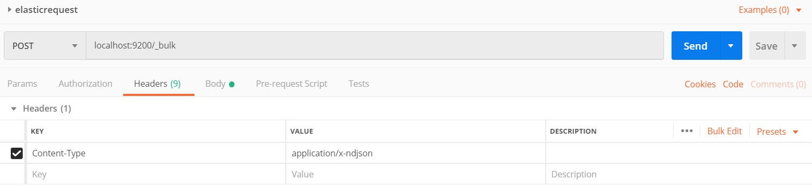
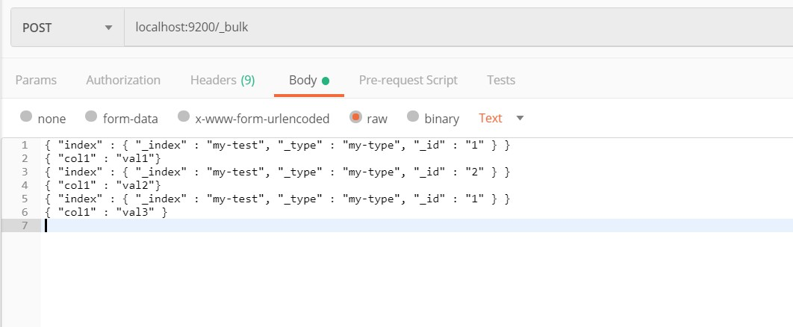
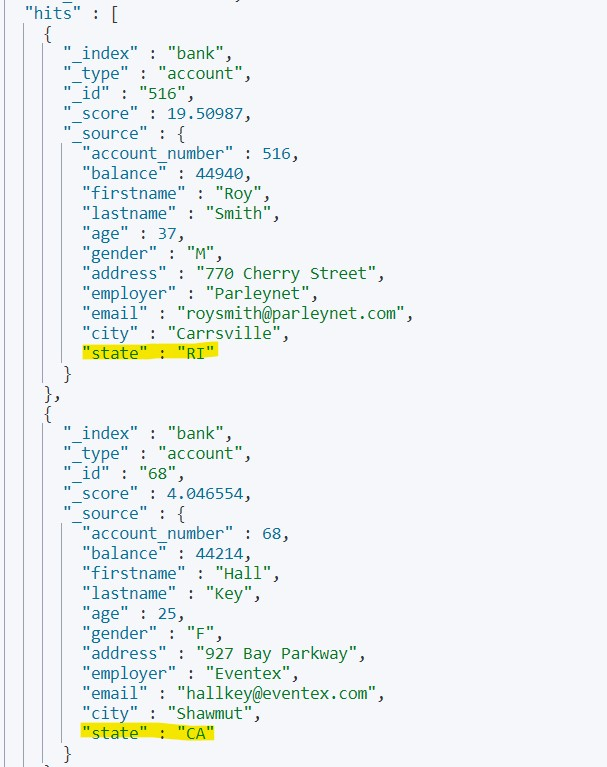

# Elastic Search 

The Elastic Search is a Part of ELK Stack which contains 4 Free Products with an addition of paid Plugins,

These Products are

1. Logstash, Main Input interface But not the only one.
2. Beats, another Input interface to The star of the show
3. Elasticsearch, The Search Engine we will be targeting in this documents 
4. Kibana, Sits on top of Elastic Search providing interface for communicating with the search engine


## Installing Elasticsearch and Kibana

### Requirements 

1. Java SDK, Namely JDK Installed, I used the latest version which is 12 By the time of this writing
2. Node.JS, This is used for Kibana and is NOT REQUIRED for Elasticsearch 
3. Elasticsearch zip, Downloaded from elastic.co, Free Opensource Cross Platform, Used Version 12 in this document
4. Kibana zip, Downloaded from elastic.co, NOT REQUIRED but it provided me with nice interface for executing the code to Elasticsearch engine

*Notes: 

Make sure JDK_HOME is enabled in your paths file, this is how windows knows where JDK is.


## Starting the Engine

1. Decompress the Zip files to some directory 
2. Inside the decompressed files go to `./bin/elasticsearch.bat` 
3. Go to Kibana directory and start `./bin/kibana.bat`
4. It will take sometime don't panic, Node takes some time to start
5. Kibana will show a message containing `localhost:<some port>` it will mostly be `5601` navigate in your browser to this link
6. voila you are in Kibana now, navigate to dev-tools from the sidebar
7. start writing some code interacting with Elastic Search :)


### Basic Command Structure in Kibana 

```
<REST Verb> <Node>/<API Name>

{

<Additional Data in JSON Format>

}
```


<b> Example </b>

```
GET /bank/_search

{

	"query":{

	}

}
```

Will Explain That in Later Sections.


## Create Data

This section is detected to the create interactions with the search engine,


### The Bulk API of the Elasticsearch (C as Create from CRUD)

Example Data:

JSON Example File: `reqs_json.json`

Commands 




and Don't Forget the Body




and Hit Send :), What a magic, you've done it!. Thank Me? your welcome.


### Create Data From Kibana Console:

Write the fallowing Command `Post _bulk <Json Data> `BUT Don't Forget to add new line to the end of JSON as it will give you an error, 

Another Tip, Specifying a Type is no longer allowed, so keep that in mind searching tuts


### Load Actual JSON File:

Well, I couldn't find a way because of the way PowerShell operates,

 The main Command was 

```
curl -H 'Content-Type: application/x-ndjson' -XPOST 'localhost:9200/bank/account/_bulk?pretty' --data-binary @accounts.json
```

but i couldn't let it work in PowerShell First there was `@accounts.json` and when i fixed it

-- using Quotations marks `"@accounts.json"`-- 

There seems to be a problem with the header :|


<b>But how Can i Check if it's there?</b>


## Read Data 

### Get Request AKA, Read (the R in CRUD):

the command is quiet simple which is: `Get /bank` now enter this in Kibana and you'll see a response representing the structure of the data.

to see some actual data we should use Search API

### Read Index 

##### `We will be using Bank data from now on, make sure you post it using Post man copying the content of accounts.json into the body of the Request`


in Kitana use the command: 

`GET /_cat/indices`

What this shows is the Indexes of all the data we entered.

we can use the names of any index from here in the search API

### Search API

the basic terminology goes like this:

`GET /bank/_search  {<query data>}`

so, first notice the `_search` which is used to indicate which API we are using.

second this `<query data>` and it's used with many verbs

third, this commands are executed in Kibana 

<b>match: </b>

it goes like this in Kitana:

```json
GET /bank/_search
"query": {
"match": {
"age":32
}
}
}
```

inside the "match" JSON we specify the fields and the expected values.

<b>match_all:</b>

shows everything the "Database" has in this index.

```json
GET /bank/_search
{
"query": {
"match_all": {}
}
}
```

or you can use `GET /bank/_search`  for short

<b> Querys With multible Matches:</b>

this example illustrates the concept 

```json
GET /bank/_search
{
  "query": {
    "bool": {
      "must": [
        {
          "match": {
            "city": "Brogan"
          }
        },{
          "match": {
            "state": "IL"
          }
        }
      ]
    }
  }
}
```

so, we used `match` Term to replicate the `=` sign or `equals` in other SQL, PHP based operations.

plus we used the `must` term to indicate the importance of this search terms.

##### More Complex Queries 

Lets say you want the list of the accounts in `CA` state and you would like to boost Men Named `Smith` in your search result, this is how you do it using internal queries 

```
GET /bank/_search
{
  "query": {
    "bool": {
      "should": [
        {
          "match": {
            "state": "CA"
          }
        },{
          "match": {
            "lastname": {
              "query": "Smith", "boost": 3
            }
          }
        }
      ]
    }
  }
}
```

in my case there was the fallowing snippet of the result:



Notice the there was somebody here that doesn't live in CA, and that's the deference between `must` and `should`, notice also that i used insider query in the Command i sent, this is to be explained in more details later.

but what is interesting also is the way Elastic search the relevant of the item regarding the query, notice in the `boost` i used number 3 which counts as 3 times more important than the `state` term.


#### Terms Query

Using the terms Query Proved Essential in fallowing the Tutorials i provide here, that's why i'm gonna explain it now:

The way this thing works is like this:

```
GET bank/account/_search
{
  "query": {
    "term": {
      "account_number": 516
    }
  }
}
```

Notice here that we used `term` to ask for something similar to a `match` query, <b>BUT</b> be careful how you use this as a query like this proved to be ill resulted

```
GET bank/account/_search
{
  "query": {
    "term": {
      "state": "RI"
    }
  }
}
```

So, as a basic Rule use `term` Queries for numerical values.


#### More than & Less Than Queries 

So, if you wan't to get the accounts from `512` to lets say `600` you would use the fallowing format:

```
GET /bank/_search
{
  "query": {
    "range": {
      "account_number": {
        "gte": 512,
        "lte": 600
      }
    }
  }
}
```

there is a couple of things here:

`gte` stand for Greater Than or Equal To.

`lte` stands for Less than or equal to.

and we used `range` instead of match here.	

#### Aggregations of Queries 

This is used to add, count and so on...

##### Count Based on Field

so lets say we wanna know the number off accounts for every state, that would be the fallowing 
```json
GET /bank/_search 
{
  "size": 0,
  "aggs": {
    "states": {
      "terms": {
        "field": "state.keyword"
      }
    }
  }
}
```

That seems to be hard, so lets walk throw it: first the `size` and we used this to tell elastic search that we don't want the results, just the aggregations back,

next `aggs` this is the way we tell Elastic Search to count data

next `terms`, it's works in a similar way to `match`, just another way of writing the query. we will discuss this later.

##### Averaging Data

Goal: Getting the average balance per state

Code:

```
GET bank/_search
{
  "size": 0,
  "aggs": {
    "states": {
      "terms": {
        "field": "state.keyword"
      },
      "aggs": {
        "avg_bal": {
          "avg": {
            "field": "balance"
          }
        }
      }
    }
  }
}

```

So, `size` Means i just want the aggregations , `states` is the name of aggregation, it works in similar way to `AS` in SQL. `terms` Explained Above, but in a nutshell it operates like `match` Now that I explained above.

`aggs` inside after the `terms` is used to calculate the average balance, how? here's how it goes, first `avg_bal` is just the name of the field, works like `AS` in SQL,  `avg` is a tag used to tell the search engine of the aggregation type, next we just added the name of the field.

for full list of aggregations go to 

https://www.elastic.co/guide/en/elasticsearch/reference/current/search-aggregations-metrics-avg-aggregation.html

and navigate from there.


#### Filtering Aggregations 

we can use the `match` in the query as fallowing 

```
GET bank/account/_search
{
  "size": 0,
  "query": {
    "match": {"state.keyword": "CA"}
  },
  "aggs": {
    "over35":{
      "filter": {
        "range": {"age": {"gt": 35}}
      },
    "aggs": {"avg_bal": {"avg": {"field": "balance"} }}
    }
  }
}
```

notice the main filter here is living inside `match` with a field name of `state.keyword` this is acquired usually by  seeing the result node before filtering it. notice that you can also filter using `gt` of this query, so this filter the `balance` average of the persons over 35 `gt = greater than ` and `gt != gte` so keep that in mind.

## Finish 

Ok this is enough commands, as for `update` and  `delete ` I'm not going to discuss it here for 2 main reasons:

	1.	It's not usually good to manipulate logs from a client side connection
 	2.	it should be assigned an `outlier` by the search engine itself
 	3.	since the Log is time restricted *-it is associated with time stamp-*  you can't really update the values.

So hope this is a good document

### Always Feedback ASAP, Waiting in Slack. C yah! ;)