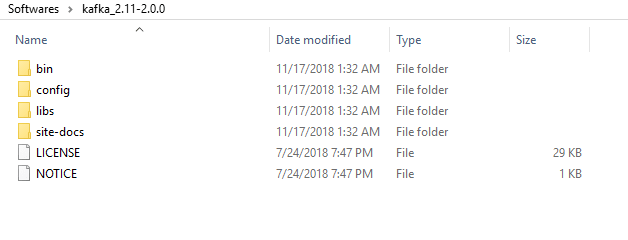
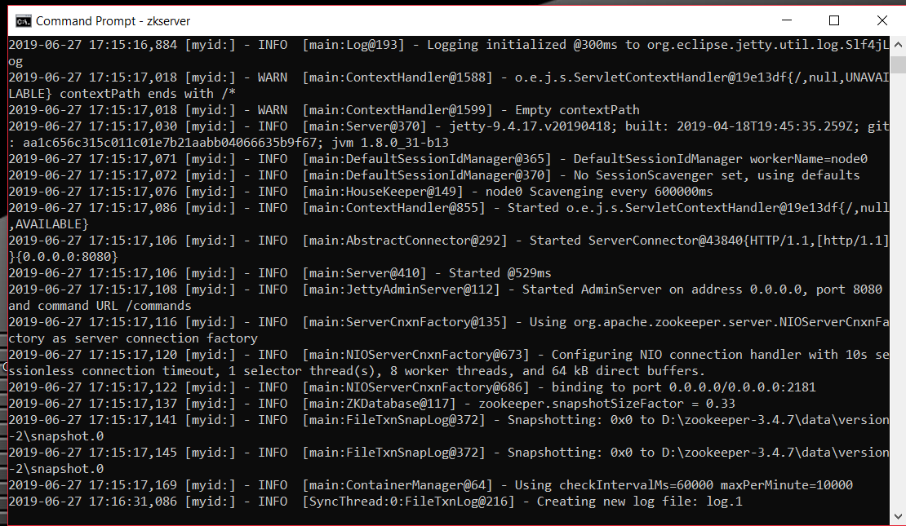
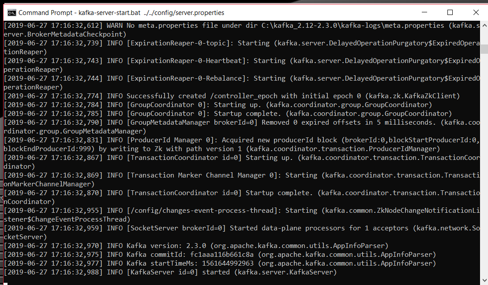
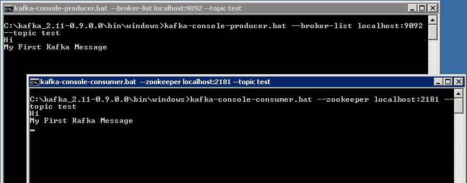

#logging-flow

## Install Apache Kafka on Windows 10
This guide helps you to understand how to install Apache Kafka on Windows 10 operating system

### Prerequisites
[Install JRE](https://www.oracle.com/technetwork/pt/java/javase/downloads/jdk8-downloads-2133151.html) before you further.

## Install Apache Kafka on Windows:
First download these files to your locals machine, extract it and you will see the below folder structure .

`/bin` directory represents all the binary files which are helpful to start Kafka server different operating systems.

`/bin/windows` directory has all the windows related stuff, As we are working with the windows machine. 

`/config` directory contains all configuration details about Kafka server, zookeeper, and logs. 

`/libs` directory contain all dependency executables like java, jetty, log4j and etc.

#### Config Zookeeper :
* Go to config folder in Apache Kafka and edit “zookeeper.properties” using any text editor.
* find and edit "dataDir=/tmp/zookeeper" to ":\zookeeper\data" using any text editor .

#### Setting up Apache Kafka :
* Go to config folder in Apache Kafka and edit “server.properties” using any text editor.
* Find log.dirs and repelace after “=/tmp/kafka-logs” to “=C:\\Tools\\kafka-logs” .
* By default Apache Kafka will run on port 9092 and Apache Zookeeper will run on port 2181

### Running Zookeeper Server :
Open command prompt and Go to Kafka_X.XX-X.X.X\bin\windows\  and then run the following command.

    .\zookeeper-server-start.bat ..\..\config\zookeeper.properties
    
    

### Running Apache Kafka :
Open a new command prompt and also Go to Kafka_X.XX-X.X.X\bin\windows\  and then run the following command .

    .\kafka-server-start.bat ..\..\config\server.properties
    

    

Now your Kafka Server is up and running, you can create topics to store messages. Also, we can produce or consume data from Java or Scala code or directly from the command prompt. and running on port 9092.
 
### Creating Topics :
1- Open a new command prompt in the location C:\kafka_x.xx-x.x.x\bin\windows.
2- Type the following command and hit Enter:
    
    .\kafka-topics.bat --create --zookeeper localhost:2181 --replication-factor 1 --partitions 1 --topic test
    
### Creating a Producer and Consumer to Test Server :
1- Open a new command prompt in the location C:\kafka_x.xx-x.x.x\bin\windows 
 
2- To start a producer type the following command:
 
    .\kafka-console-producer.bat --broker-list localhost:9092 --topic test
    
3- Again open a new command prompt in the same location as C:\kafka_x.xx-x.x.x\bin\windows
 
4- Now start a consumer by typing the following command:
 
    .\kafka-console-consumer.bat --zookeeper localhost:2181 --topic test
    
5- Now you will have two command prompts.

6- Now type anything in the producer command prompt and press Enter, and you should be able to see the message in the other consumer command prompt.
 
