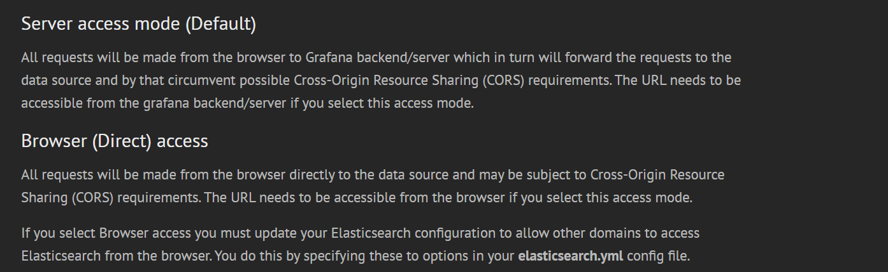

# logging-flow

## Grafana Dashboard
Grafana is an open source solution for running data analytics, pulling up metrics that make sense of the massive amount of data & to monitor our apps with the help of cool customizable dashboards.

Grafana connects with every possible data source, commonly referred to as databases such as Graphite, Prometheus, Influx DB, ElasticSearch, MySQL, PostgreSQL etc.

### Install And Configuration Grafana 
1. First download [Grafana](https://grafana.com/grafana/download?platform=windows) For Windows, (You can download it as zip file)
2. Important: After you’ve downloaded the zip file and before extracting it, make sure to open properties for that file (right-click Properties) and check the `unblock` checkbox and `Ok`.
3. Extract this folder to anywhere you want
4. Go into the `conf` directory and copy `sample.ini` to `custom.ini`. You should edit `custom.ini`, never `defaults.ini`.
5. Edit `custom.ini` and uncomment the `http_port` configuration option and change it to something like `8080` or similar.
6. Start Grafana by executing `grafana-server.exe`, located in the `bin` directory.
7. Default login and password `admin`/ `admin` .
8. To run Grafana open your browser and go to the port you configured above, e.g. `http://localhost:8080/`. 

### The Basics Steps For Using Elasticsearch In Grafana 
To Use Grafana We Have TO Follow These Steps :
1. From Side Menu On Configuration Option We Select `Data Sources`
2. Select The Data Sources We Want ex : `Elasticsearch`
3. Inserted Our Data Into Elasticsearch Window
4. Create New Dashboard
5. Add New Panel
6. Edit This Panel By Clicking On The Title And Select `Edit`
7. By These Steps We Will Have First Simple Graph

### Adding the data source
1. In the side menu under the `Configuration` link you should find a link named `Data Sources`.
2. Click the `+ Add data source` button in the top header.
4. Select `Elasticsearch` from the Type dropdown.
5. This window will be display

    Name	: The data source name. This is how you refer to the data source in panels & queries.
    Default	: Default data source means that it will be pre-selected for new panels.
    Url     : The HTTP protocol, IP, and port of your Elasticsearch server.
    Access	: Server (default) = URL needs to be accessible from the Grafana backend/server, Browser = URL needs to be accessible from the browser.

## Result Until Now
1. There is nothing to Say until now because grafana didn't display any graph after insert the `elastic url and data`
2. grafana don't accept any index name that elastic provided as `(kafka_1, my-test, ...)`
3. tomorrow i will change the way about learning and i will start about `HTTP API` in Grafana
4. finally what the meaning of these two Phrases

