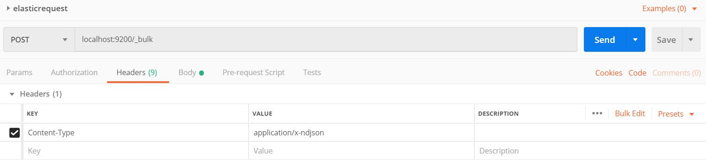
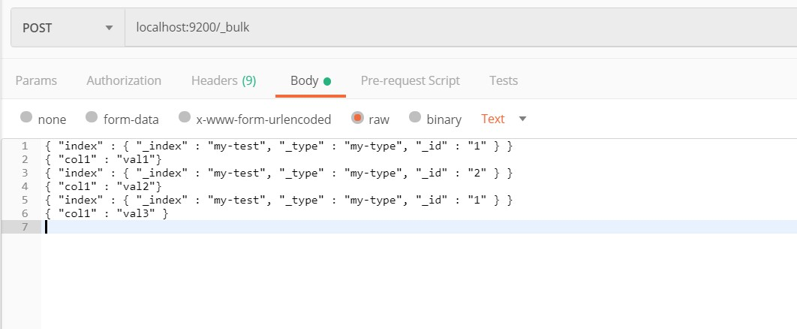

# Elastic Search 

The Elastic Search is a Part of ELK Stack which contains 4 Free Products with an addition of paid Plugins,

These Products are

1. Logstash, Main Input interface But not the only one.
2. Beats, another Input interface to The star of the show
3. Elasticsearch, The Search Engine we will be targeting in this documents 
4. Kibana, Sits on top of Elastic Search providing interface for communicating with the search engine

## Installing Elasticsearch and Kibana

### Requirements 

1. Java SDK, Namely JDK Installed, I used the latest version which is 12 By the time of this writing
2. Node.JS, This is used for Kibana and is NOT REQUIRED for Elasticsearch 
3. Elasticsearch zip, Downloaded from elastic.co, Free Opensource Cross Platform, Used Version 12 in this document
4. Kibana zip, Downloaded from elastic.co, NOT REQUIRED but it provided me with nice interface for executing the code to Elasticsearch engine

*Notes: 

Make sure JDK_HOME is enabled in your paths file, this is how windows knows where JDK is.

## Starting the Engine

1. Decompress the Zip files to some directory 
2. Inside the decompressed files go to `./bin/elasticsearch.bat` 
3. Go to Kibana directory and start `./bin/kibana.bat`
4. It will take sometime don't panic, Node takes some time to start
5. Kibana will show a message containing `localhost:<some port>` it will mostly be `5601` navigate in your browser to this link
6. voila you are in Kibana now, navigate to dev-tools from the sidebar
7. start writing some code interacting with Elastic Search :)

## CRUD Operations (Create, Read, Update, Delete Queries)

### The Bulk API of the Elasticsearch 

Example Data:

JSON Example File: `reqs_json.json`

Commands 

and Don't Forget the Body

and Hit Send :), What a magic, you've done it!. Thank Me? your welcome.

But how Can i Check if it's there?

### Get Request AKA, Read (the R in CRUD):

the command is quiet simple which is: `Get /my-test` now enter this in Kibana and you'll see the data.

### Create Data From Kibana Console:

Write the fallowing Command `Post _bulk <Json Data> `BUT Don't Forget to add new line to the end of JSON as it will give you an error, 

Another Tip, Specifying a Type is no longer allowed, so keep that in mind searching tuts

### Load Actual JSON File:

Well, I couldn't find a way because of the way PowerShell operates,

 The main Command was 

`curl -H 'Content-Type: application/x-ndjson' -XPOST 'localhost:9200/bank/account/_bulk?pretty' --data-binary @accounts.json`

but i couldn't let it work in PowerShell First there was `@accounts.json` and when i fixed it

-- using Quotations marks `"@accounts.json"`-- 

There seems to be a problem with the header :|

### Read Index 

in Kitana use the command: 

`GET /_cat/indices`

### Search API